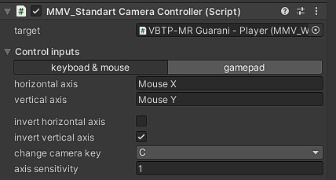

Another Systems
===============

Shooter Manager Component
~~~~~~~~~~~~~~~~~~~~~~~~~

Responsible for managing gun fire.

Shot
----

Describe all main shooting behavior.

**spawner:** Transform from the position where the shot will come from.

**bullet:** The projectile that will be instantiated. It is important that this object has the Projectile component.

**ignore layer:** The projectile will only identify a collision with another object if it does not have that layer defined.

**bullet velocity:** Speed in meters per second that the projectile moves.

**bullet life time:** After “X” seconds the projectile will be destroyed automatically even without having collided with another object.

**bullet explosion force:** The explosion force that will be assigned to nearby objects when they collide with something.

**bullet explosion range:** The distance to identify nearby objects to apply explosion force after colliding with another object.

**explosion force curve:** The strength of the explosion force over the distance when the projectile collides.

**reload time:** The weapon's reload time.

**recoil:** The force of the shot applied to the vehicle.

Effects
-------

Applies effects when firing.

**Particles:** Particles that will be instantiated when it fires.

Sound
-----

.. figure:: images/advanced_configurations/shooter_manager/shooter_manager_sound.jpg

**audio source:** Audio source that will be used to play the trigger sound.

**clip:** The audio clip of the shot.

Standart Camera Contoller Component
~~~~~~~~~~~~~~~~~~~~~~~~~~~~~~~~~~~

Standard MMV camera controller, capable of delivering different types of camera positioning such as 3rd person, 
commander's view and sniper's view.

target: add the target vehicle to be followed by the camera.

Add player controls to be able to control the camera, it is possible to configure both keyboard 
and mouse and gamepad.

**See for configure your Axes:** `Unity Input Manager <https://docs.unity3d.com/Manual/class-InputManager.html>`__

**horizontal Axes:** Horizontal Axes of the Input Axes to rotate the camera horizontally.

**vertical Axes:** Vertical Axes of the Input Axes to rotate the camera vertically.

**invert horizontal Axes:** Invert the direction of the player control's horizontal Axes.

**invert vertical Axes:** Invert the direction of the player control's vertical Axes.

**change camera key:** The key or button to switch between cameras if you have more than one.

Camera Behaviour
----------------

Describe how the camera should behave.

**camera turn speed:** The speed at which the camera rotates

**crosshair layer:** Layer of objects that have a collider.

types
-----

Game cameras.
.............

**amount:** Number of vehicle cameras.

Camera "X"
__________

**camera:** The chosen camera.

**type:** The type of camera.

.. note::

    **THIRD_PERSON:** The camera moves around the vehicle and uses the “Camera Collider” to avoid obstacles.

    **FIRST_PERSON:** Stays in the same place, but can be rotated vertically and horizontally.

    .. figure:: images/advanced_configurations/camera_controller/standart_camera_controller_camera_types_demo.jpg

**min vertical:** The minimum angle to the vertical.
**max vertical:** The maximum angle vertically.

Options for FIRST_PERSON
^^^^^^^^^^^^^^^^^^^^^^^^

**max horizontal:** The maximum angle the camera can turn horizontally.

Options for THIRD_PERSON
^^^^^^^^^^^^^^^^^^^^^^^^

**camera height:** The height of the camera relative to the vehicle.

**camera distance:** The distance of the camera from the vehicle

**align to vehicle:** Aligns the Y axis of the camera with that of the vehicle, by default it is already activated in FIRST_PERSON mode.

**camera collision:** Camera collision sensor, prevents it from entering walls, add here the collision layers of your scene, by default the layer is *“Default”*.