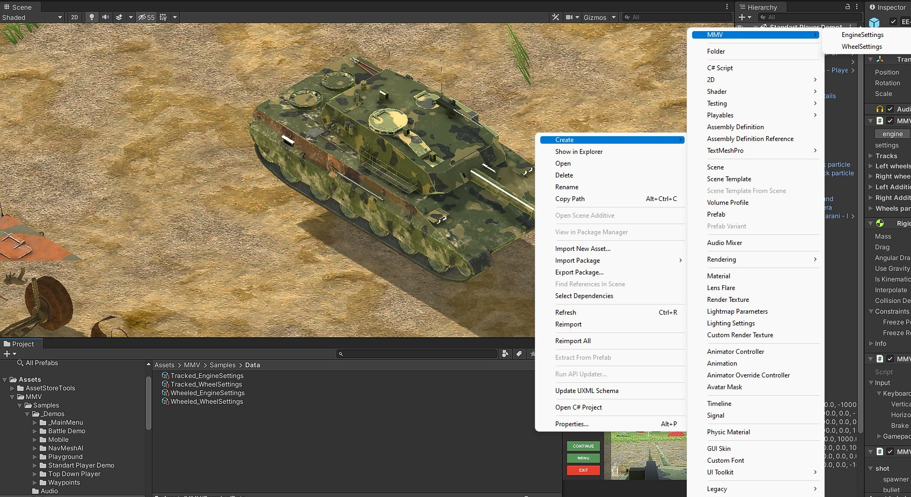
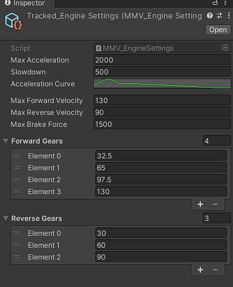
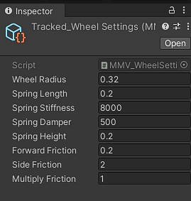

Configuration Files
===================

Configuration files are scriptableObjects that contain data that can be used by different MMV systems. For example, create a configuration 
file that contains all information about a type of engine, and that engine can be used by many different vehicles.

Creating Any Configuration File
~~~~~~~~~~~~~~~~~~~~~~~~~~~~~~~

| To create a configuration file, go to your "Project" window and right click somewhere:
| Create -> MMV -> ....

.. _engine settings:

Engine Settings
~~~~~~~~~~~~~~~

An engine configuration file is responsible for storing all the behavior data of an engine in an MMV vehicle.

**Max acceleration:** The maximum acceleration force that the vehicle can achieve

**Slowdown:** Speed at which the vehicle decelerates

**Acceleration curve:** Acceleration curve based on current vehicle speed, must never go beyond (0 - 1) horizontally or vertically

**Max forward velocity:** Maximum speed the vehicle can reach by accelerating forward

**Max reverse velocity:** Maximum speed the vehicle can reach by accelerating backwards

**Max brake force:** Vehicle braking force

**Gears Forward/Backward:** Forward or reverse gear shifting speeds

.. _wheel settings:

Wheels Settings
~~~~~~~~~~~~~~~

**Wheel radius:** vehicle wheel size

**Spring length:** Suspension size of each wheel

**Spring stiffness:** Suspension force

**Spring damper:** Suspension smoothing

**Spring height:** Height of start of suspension

**Forward friction:** front wheel friction

**Side friction:** side wheel friction
