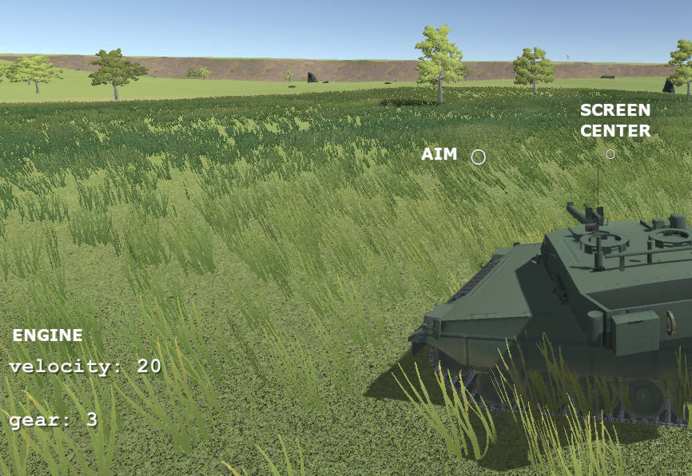
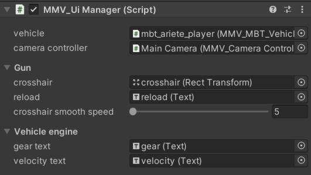

=============
UI Management
=============

**MMV** allows you to access vehicle components to create your own custom **UIs** 
or use the official one. Create speeds, acceleration, aiming marker and 
whatever else you want. By default the **MMV** brings the ``MMV_UI_Manager`` which 
has some basic properties like speed marker, gears and cannon sight marker.

MMV_UI_Manager
--------------

The default **MMV** UI component, add it to a canvas and configure it to show the vehicle's 
aim marker, speed and current gear.

* **vehicle:** Any vehicle with the MMV_MBT_Vehicle component.
* **camera controller:** Vehicle Camera Controller (must be default component ``MMV_CameraController``).

Gun:
    * **crosshair:** An ImageRenderer with the crosshair marker image. The marker will follow the movement of the cannon to see where it is aiming.
    * **reload:** The UI Text component to show the reload time when the vehicle fires.
    * **crosshair smooth speed:** make the aiming marker movement smoother.

Vehicle Engine:
    * **gear text:** UI text component that shows the vehicle's current gear.
    * **velocity text:** UI text component that shows the vehicle's current speed.

Creating Custom UI Manager
--------------------------

A manager can be any script, you just need to take the data you need from your vehicle 
or whatever and assign it to your UI elements.

.. code-block:: csharp

    velocityText = vehicle.LocalVelocity.z.ToString("0");
    gearText = vehicle.vehicle.CurrentGear.ToString();
    anotherText = vehicle.SomeProperty.ToString();
