.. _Creating Vehicle:

Create your own MBT Vehicle
============================================

Before creating your own vehicle, take a look at what comes with the project, 
change some settings so that you understand a little of what each option does, 
but anyway we are trying to make it as simple as possible to configure, alias, 
if by If you find something that doesn't make sense or is difficult to configure 
or understand, please send your feedback to help us make MMV better every day.

.. _Simple vehicle tutorial:

Importing vehicle model
~~~~~~~~~~~~~~~~~~~~~~~~

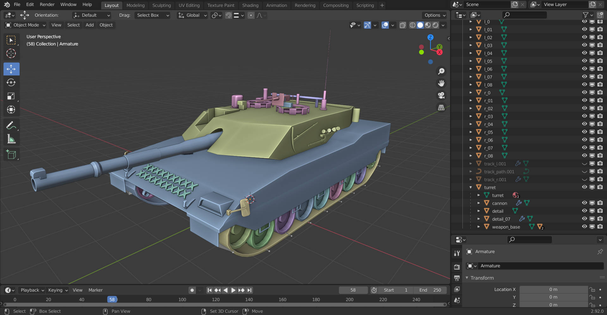

.. warning::

    Before importing a 3d model, make it follow the defaults of the example vehicle model:

.. _Model hierarchy:

Hierarchy
---------

To create a complete vehicle, you need 8 components, but only 3 are required:
    * Body
    * Turret
    * Cannon
    * Left wheels (all separate)
    * Right wheels (all separate)
    * Armature
    * Left Track (riged)
    * Right Track (riged)

You can follow this example hierarchy to organize your models:

.. figure:: img/configuring_vehicle/mbt_model_hierarchy.jpg
    :scale: 70%

| **Blue - Empties**
| **Pink - Meshs**
| **Green - Armature**

Orientation
-----------

In order for the MMV to work correctly, make sure your model has **all the 
objects** with the **identity transformation** and must also be pointed with 
the **Z Axis to forward** and and **scale = 1**.

.. warning::
    
    If this is not done, many orientation problems will happen and can 
    generate very annoying bugs, so don't use your model **.Blend file** if you 
    use Blender (or any poorly configured model) as the axes may be in the 
    wrong directions.

Exporting complex models with armor from Blender to Unity with identity 
transformations is a bit complicated, luckily there is a `plugin for Blender 
<https://github.com/EdyJ/blender-to-unity-fbx-exporter>`__ that can do the 
export in a simple way, I recommend you use it to not have so many problems.

.. note::

    If you use other 3D modeling software and also have export issues,  please 
    open a `new Issue <https://github.com/RuanLucasGD/MMV-Docs/issues>`__ so 
    we can work on it.

After installing the plugin, you will have this option along with the other 
export options.

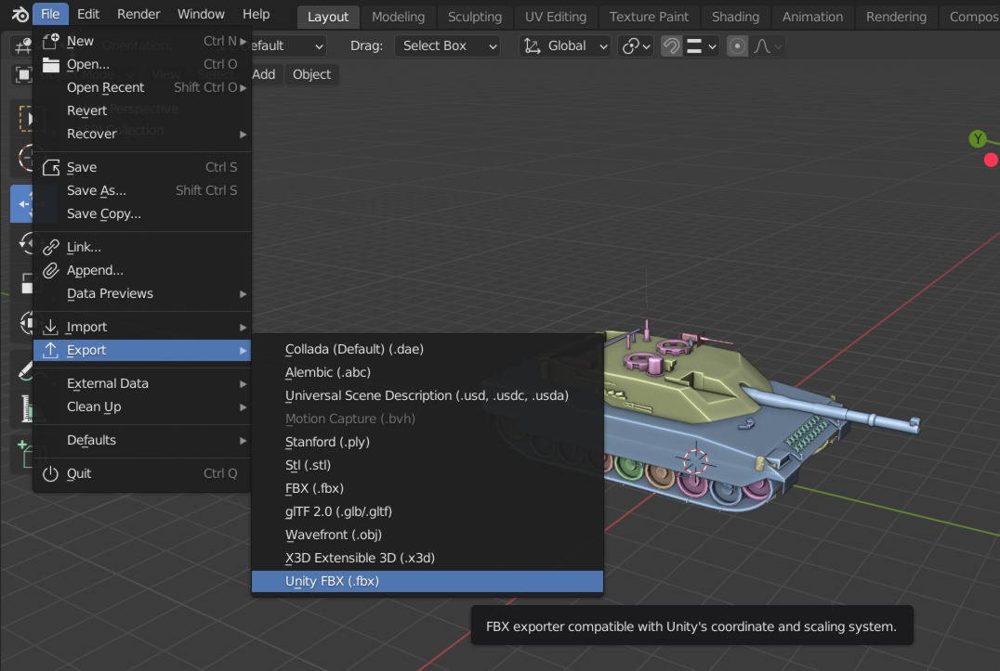

.. _Tracks model:

Tracks
------

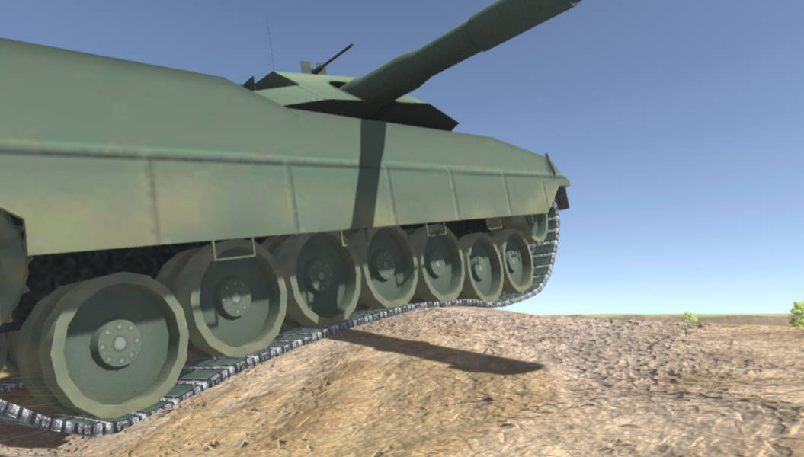

For treadmill vehicles, there must be 2 models, left treadmill and right 
treadmill that need to be attached to a skeleton. The skeleton must have 
bones that run through the entire mat, one bone per wheel.

.. figure:: img/importing_models/mbt_tracks_structure.jpg

These settings are important because the bones will simulate the movement 
of the conveyor, each bone will follow the position of the wheels (via 
script, no configuration is needed for this in the model), and with this 
the conveyor will follow the position of the wheels .

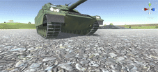

Track movement depends on how your UV has been set up. UV influences speed, 
direction and how the belt is drawn on the model.

Simple Vehicle
~~~~~~~~~~~~~~~

For starters, it's important that you have a test scene to be able to simulate 
physics, let's use this simple scene for the tutorial.

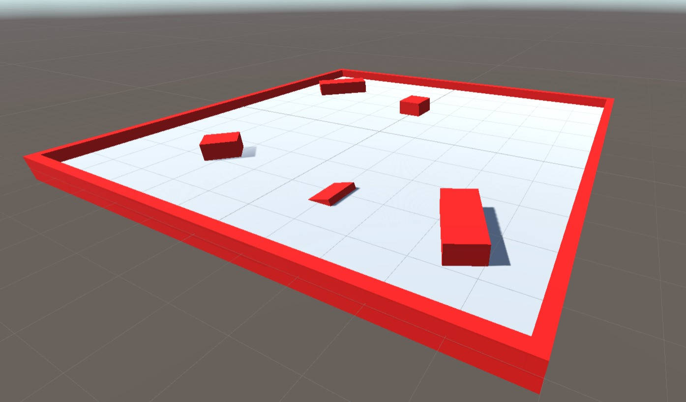

Now drag your vehicle model to the scene for us to configure. This is the default 
template that comes in the example assets.

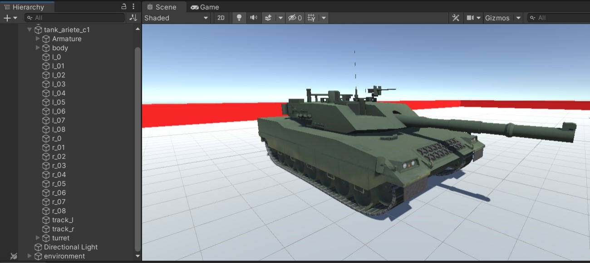
.. _Vehicle hierarchy:

Vehicle Hierarchy
-----------------

Before adding the control and physics scripts we need to configure the wheels, the 
wheel hierarchy is similar to any standard Unity vehicle, you need to have empty 
gameObjects for physics and another gameObject like meshRenderer for the wheel model.

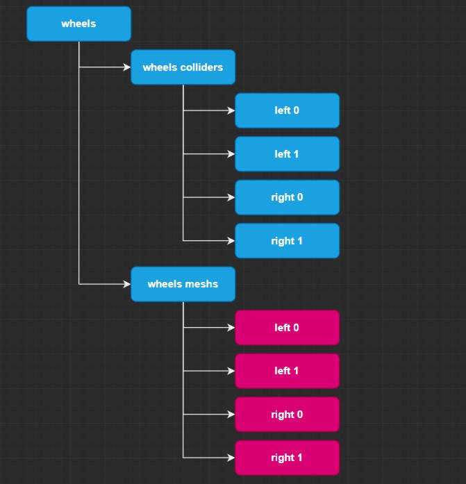

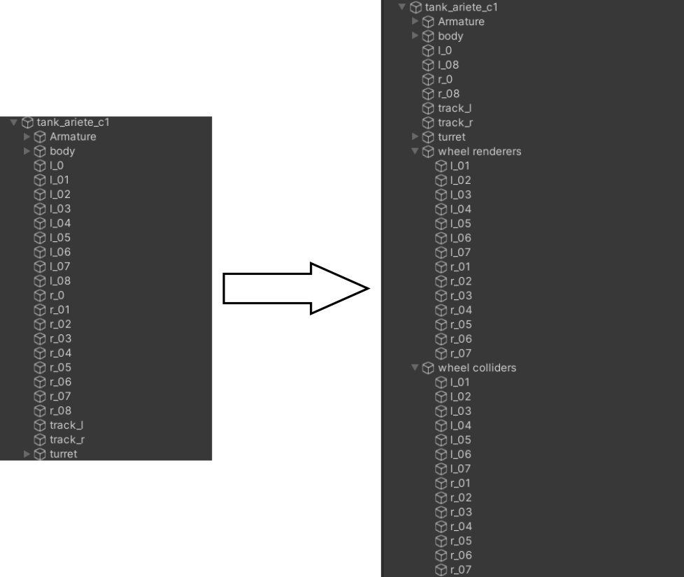

The first and last wheel on each side don't need to go with the others as they don't 
have physics, of course it depends on your vehicle, but let's focus on this one. These 
wheels only need to keep up with the rotation of the others and that's why they have a 
different configuration and we don't need to modify anything here.

.. _Minimum functional:

Minimum functional
------------------

Make sure the model has some collider for your body.

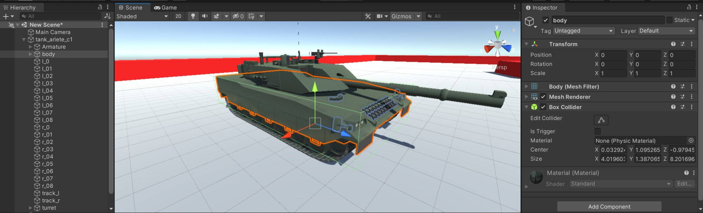

For your MBT to have physics add the ``MMV_MBT_Vehicle`` component to your **GameObject 
root of the vehicle**

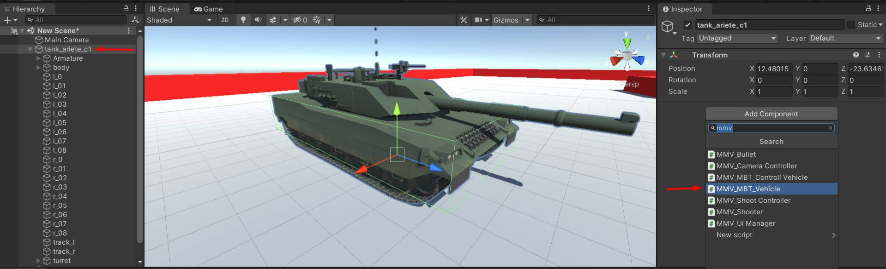

When the component is added, many settings will already be adjusted to make your life 
easier, including a **RigidBody** component will be added and its mass will be set to 1000, 
the default setting.

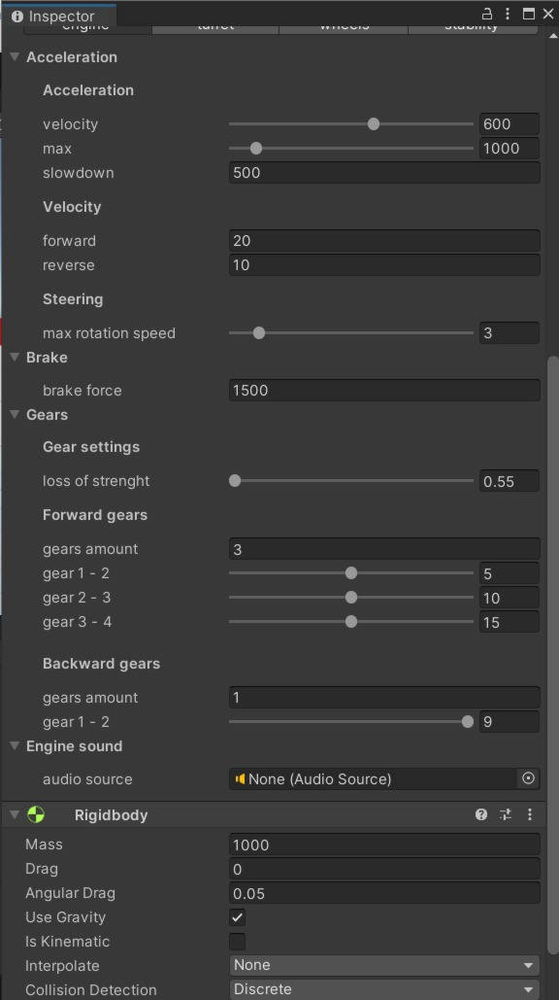

To see it work we must add the wheels to our wheel manager. Let's select the empty gameObjects 
that represent the wheel colliders.

.. figure:: img/configuring_vehicle/mbt_wheel_colliders_hierarchy_default.jpg

You can add your wheels here, be careful to separate the sides correctly (right and left).

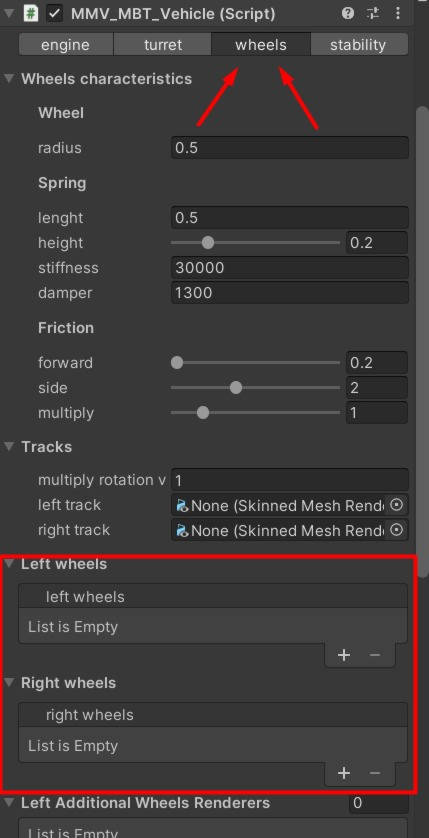

Once you have added the objects for the wheel colliders, it will look something like this. 
We'll leave the other spaces empty, we don't need them now.

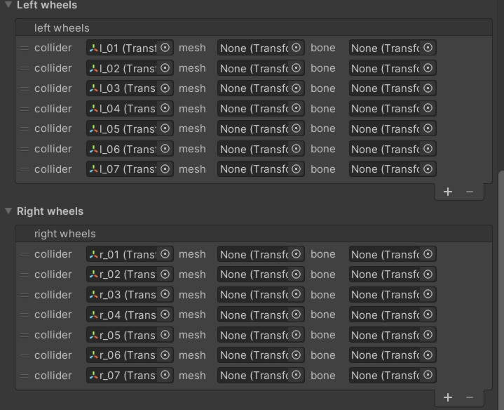

That's enough for our vehicle to have physics. If your **Gizmos** are active and the vehicle is 
selected you will be able to see the representation of the wheels.

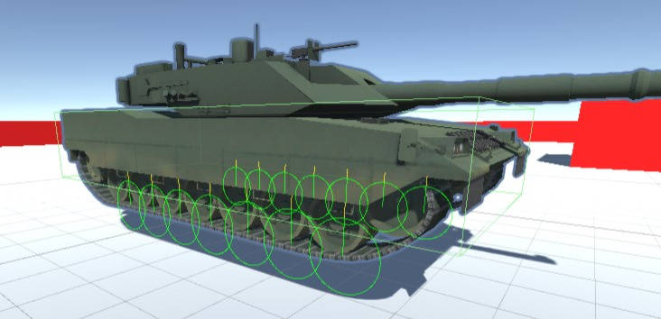

.. figure:: img/configuring_vehicle/mbt_physics_demo.gif
    :scale: 130%

Adding a Simple Controller
--------------------------

To be able to control your vehicle, add this component, it already gives you all the necessary 
inputs to control your vehicle using keyboard, mouse and gamepad.

Add the Axis of your project inputs to make your vehicle move. Also add some key or button on 
the gamepad for the brake. You don't need to have both inputs configured, you can control the 
vehicle with just one input type.

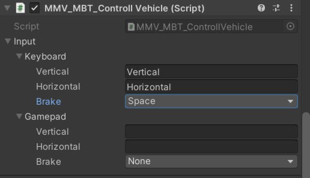

Once configured we can see the controls working.

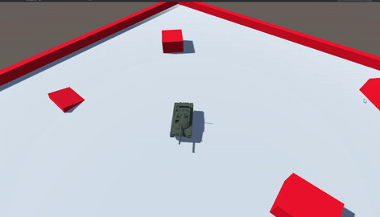

Advanced Vehicle Configuration
~~~~~~~~~~~~~~~~~~~~~~~~~~~~~~

To proceed, make sure you have seen the previous chapter of this `Simple vehicle tutorial`_ as 
it explained important things on how to create a vehicle. Here is a continuity showing details 
of configurations and how to improve our vehicle, let's go module by vehicle module, talk about 
control and camera, have fun.

Engine
------

An important module for making wheel acceleration and brake calculations.

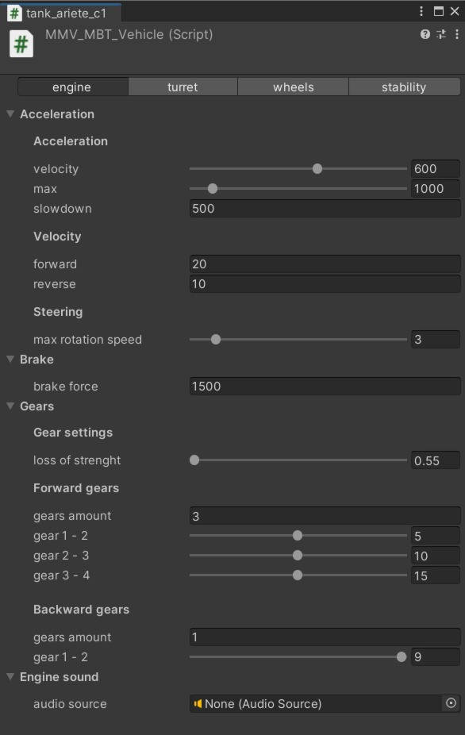

Acceleration
............

Configure to make the vehicle more agile, control the maximum speed, acceleration speed, brake 
force and maximum rotation speed.

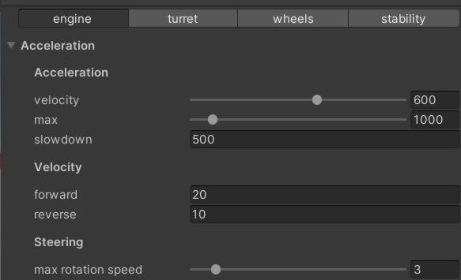

Acceleration

    * **velocity:** the speed at which the vehicle accelerates, change so that the engine can reach full throttle faster or slower. Speed also influences the speed the vehicle takes to change direction (turn).
    * **max:** the maximum engine throttle, the greater the power, the better for riding on broken terrain and the rotation speed improves and increases.
    * **slowdown:** The force to decelerate when the controller does not provide any accelerating force.

velocity

    * **forward:** maximum speed the vehicle can move forward.
    * **backward:** maximum speed the vehicle can move backward.

Sterring

    * **max rotation speed:** limits the rotation speed (change of vehicle direction) when the acceleration force of the engine is too high.

Brake
.....

Configure the vehicle brake.

Brake

    * **brake force:** brake force.

Gear System
...........

Configure so that the engine has different acceleration phases (transmission system), 
the gear change is done by automatic. The higher the current gear, the higher the speed 
and the lower the acceleration force, making it harder to climb hills. The gear shift 
also influences the engine sound.

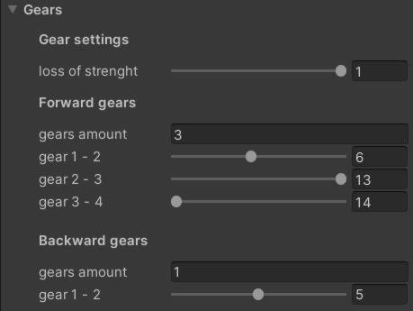

Gear Settings
    
    * **loss of strength:** How much power the vehicle loses per gear, influences acceleration at high speeds and steep hills or any complicated place.

Forward Gears

    * **gears amount:** the amount of gears to accelerate forward.
    * **gears:** set the values for gear changes at the correct speed.

    **Example**

    .. figure:: img/configuring_vehicle/vehicle_gear_bar_example.svg

Backward Gears

    * **gears amount:** the amount of gears to accelerate backward.
    * **gears:** set the values for gear changes at the correct speed.

Engine Sound
............

Simulate engine sound with gearshift effects

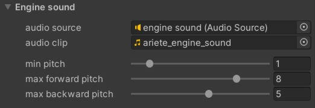

* **audio source:** audio player responsible for reproducing the engine sound.
* **audio clip:** engine sound audio clip.
* **min pitch:** minimum pitch simulates the engine without acceleration.
* **max forward pitch:** the higher the pitch the easier it is to notice the full throttle of the engine moving forward.
* **max backward pitch:** the higher the pitch the easier it is to notice the full throttle of the engine moving backward.

Turret
------

Responsible for controlling the turret and cannon to aim at targets.

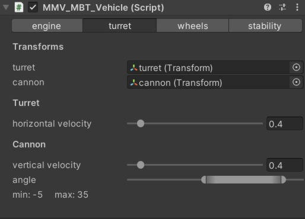

Transforms

    * **turret:** the tower transform.
    * **cannon:** the turret cannon.

Turret

    * **horizontal velocity:** turret horizontal rotation speed.

Cannon

    * **vertical velocity:** cannon vertical rotation speed.
    * **angle:** the maximum and minimum angle the cannon can be.

Wheels
------

Apply physics to wheels and conveyor movement.

.. figure:: img/configuring_vehicle/modules/mbt_wheels.jpg
    :scale: 70%

.. note::
    
    All wheels have the same suspension configuration and handling.

Wheels caracteristics
.....................

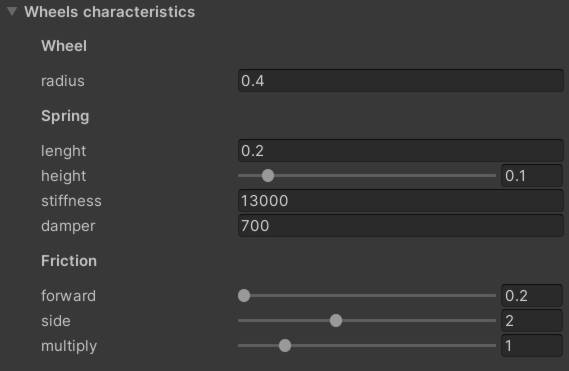

Wheel

    * **radius:** size of all wheels.

Spring

    * **lenght:** suspension size.
    * **height:** It is important that the suspension start position (wheel collider position is used as base) is always inside the vehicle body collider so that no strange bugs occur **when the spring is 100% compressed**. Not all vehicles have the wheel position inside the collider (it can be above the wheel) and so there is this option for the suspension position to be a little above the wheel, so it is easy to make the suspension position or inside the collider of the vehicle body. It is recommended that you leave it at 0.2 to 0.5, but it varies from vehicle to vehicle. When the collider already covers the wheel position this variable has no effect. You can see the height representation if your 3D view gizmos is active (yellow line at wheel position).
    * **stiffness:** How strong the suspension is.
    * **damper:** Smooths vehicle balance.

Friction

    * **forward:** amount of forward slip.
    * **side:** amount of slip on curves.
    * **multiply:** proportionally increase or decrease frontal and lateral stiffness. You can use this value to simulate different types of terrain.

Tracks
......

Applies acceleration effect to tracks.

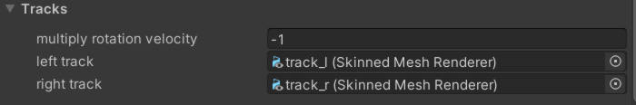

* **multiply rotation velocity:** track speed varies from vehicle to vehicle depending on how the UV and track models are set up, fine tune the track speed to match the speed of the wheels.
* **left track:** your left track.
* **right track:** your right track.

Weels (left and right)
......................

Add your wheel, mesh and bone colliders here.

.. figure:: img/configuring_vehicle/modules/mbt_wheels_wheels_2.jpg

.. warning::

    Before proceeding, see:
        * `Model hierarchy`_.
        * `Tracks model`_.
        * `Vehicle hierarchy`_.

* **collider:** gameobject that represents the position of the wheel.
* **mesh:** wheel model.
* **bone:** bone representing the wheel (used to simulate conveyor movement).

Additional wheels renderers (left and right)
............................................

.. figure:: img/configuring_vehicle/modules/mbt_wheels_additional_wheels.jpg

If you read `Vehicle Hierarchy`_ you must have noticed that the first and last wheel on each 
side does not follow the same pattern as the others (of course it depends on the vehicle), in 
a common tank like the one since asset, it has no physics in these wheels, they just run together 
with the too much. In this case, we add these additional wheels that do not have physics to this 
list so that they follow the movement of the others.

Wheels particles
................

.. figure:: img/configuring_vehicle/modules/mbt_wheels_particles.jpg

Add dust particles here for when your vehicle moves. You need to have a particle on each side, 
all of them filling the place of the wheels and already configured the way you want, the emission 
will be controlled by the wheel system itself.

* **left particle:** left particle.
* **right particle:** right particle.
* **max emission:** the faster the vehicle goes, the more it will be emitted, ``vehicle_velocity * max_emission``. Be careful when increasing this value above 1 to avoid sudden drops in performance.
* **stop delay:** When a vehicle jumps on a ramp on a dirt road we can see a trail of dust in the air that comes out of the wheels for a few seconds and then ends, increasing the delay you can simulate this.

Stability
---------

Control the effect of gravity on the vehicle

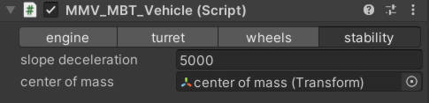

* **slope deceleration:** Forces the vehicle to go downhill on sloping places, as if the engine couldn't handle climbing hills.
* **center of mass:** An important part, the stability of the vehicle in inclined places, curves and vehicle rotation are influenced by the mass control, put here the position of the center of mass of your vehicle, the further up it is, it will be easier to tip over in curves, and the further forward or sideways it goes, the Y rotation of the ve will change.

**Slope deceleration**

**Center of mass**

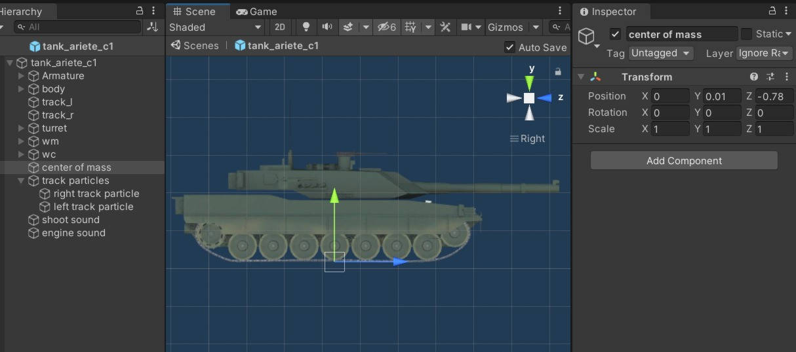

