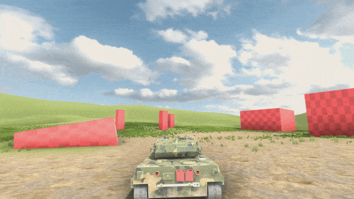

Creating Vehicle from Scratch
=============================

Since you read the :ref:`overview-main-system` , we are finally going to create our vehicle 
using standard **MMV** components. Creating the vehicle from scratch requires 
the user to follow some important configuration steps especially when 
exporting the model to **Unity**.

For this tutorial, we separated it by steps to make it simpler, remembering 
that all the options of the components will not be explained for didactic 
reasons. All explanation about the properties will be done in :ref:`advanced-vehicle-configuration`.

Configuring Model
~~~~~~~~~~~~~~~~~

This is a part that may raise questions or some unknown issue, please report your feedback 
on `GitHub <https://github.com/RuanLucasGD/MMV-Docs/issues>`__ if you have any problems so we can 
improve our documentation.

For everything to work well, it is important to have the model configured following some 
rules, mostly related to transformation. All objects have the **axis configured correctly and the 
scale of the objects must be applied.**

In the case of **MBT vehicles** (tanks), you need to be extra careful because these vehicles use tracks 
on the wheels.

We are going to use `Blender <https://www.blender.org/>`__ in this tutorial, but the settings apply to 
all 3D modeling software.

1. Check the world scale, leave it as meters and with the scale 1.

2. All objects need to have their identity rotation and scale, the forward axis of the object needs to 
be correct (in Blender's case, the forward is -Y, up Z), follows the example below.

3. Each wheel must be an object, they can have the same mesh as long as it's one mesh for the right
wheels and another one for the left wheels.

4. Keep the vehicle in the correct starting position, in the center, with the wheels touching the ground.

Configuring Tracks
^^^^^^^^^^^^^^^^^^

There are two things we need to do: configure the armature and adjust the mat UV.

The armor is based on a **ROOT** bone that is in the center of the vehicle, and one bone per wheel is mandatory, 
the other bones are optional to help with the distribution of the mesh.

You can take a look at the models to better understand how the framework works.

The tracks must be **individual objects**, and both must be **attached to the armature**.

this is the result of how it should look.

.. figure:: images/creating_vehicle/mbt_tracks_bones_demo.gif
    :alt: 0%
    :scale: 100%

.. note::
    It might be interesting to rename all the parts of the model, especially the ones that will be used in the **MMV** like wheels and bones.

    As you can see, we have separated the right and left wheels.

    .. figure:: images/creating_vehicle/wheels_name.jpg
        :alt: 0%
        :scale: 75%

    It might be interesting to rename all the parts of the model, especially the ones that will be used in the **MMV** like wheels and bones.

    As you can see, we have separated the right and left wheels.The bones that will be used in also contain similar names, the ones that were 
    not named are additional bones that will not be used by the system, you can use the names you want, this is just to help with the organization.

    .. figure:: images/creating_vehicle/bones_name.jpg
        :alt: 0%
        :scale: 75%

After all the configuration is done, we can finally export the model.

Exporting Model
~~~~~~~~~~~~~~~

We must remember that all exported objects must have their identity transformation 
inside the unity (rotation and scale) as in the example:

The export configuration will vary from program to program and unfortunately we won't 
be able to explain the process to everyone. In **blender**, doing this export can generate 
a headache because the axes can be rotated or the model scale can be wrong mainly 
because our vehicle model can have rig.

Luckily a good soul made a plugin for blender that takes care of that and helps us export 
models to unity with the correct axes and scale setup. `Install this plugin <https://github.com/EdyJ/blender-to-unity-fbx-exporter>`__ in blender, and 
you will have this export option:

From there just choose the location where to save and import in Unity.

Setting Up Model in Unity
~~~~~~~~~~~~~~~~~~~~~~~~~

Now we have to configure the model in unity, calm down, it's simple. We just need to separate 
the wheels so that the physics system can understand what mesh is and what is will apply wheel physics.

Basically we have to transform our model hierarchy which is this:

In this:

In short, duplicating the wheels and separating them into colliders and meshes, and taking the MeshRenderer 
out of the colliders, that's all.

We also have to organize the tower structure, a good diagram to use as an example would be:

After the proper settings, we are finally going to add physics to our vehicle.

Adding physics to the vehicle
~~~~~~~~~~~~~~~~~~~~~~~~~~~~~

The MMV comes with a lot of things set up by default, but you need to take care of adding what's 
missing, like specific objects and components.

Let's go in stages:

1. For your vehicle to have physics, it must first have a body collider:

    .. figure:: images/creating_vehicle/vehicle_add_collider.gif
        :alt: 0%
        :scale: 100%

2. Add the vehicle component:

    .. figure:: images/creating_vehicle/add_vehicle_component.jpg
        :alt: 0%
        :scale: 80%

    When you add this component, by default it will add a **RigidBody** to the physics object.

3. Add the objects that applied the wheel physics in the wheel manager:

    .. figure:: images/creating_vehicle/vehicle_component_empty_wheels.jpg
        :alt: 0%
        :scale: 60%

    * A wheel is made up of 3 objects:

        .. figure:: images/creating_vehicle/wheel_data.jpg
            :alt: 0%
            :scale: 40%

        | **"wc"** to apply physics.
        | **"wm"** which is the mesh that follows the movement of the wheel.
        | **"bone"** which is the bone that accompanies the wheel and makes the belt move.

        Let's add all the "WCs" of the wheels and the vehicle physics will already be working.

        .. figure:: images/creating_vehicle/mbt_add_wheels_wc.jpg
            :alt: 0%

        As you can see, some wheels were ignored, it's the front and rear wheels, that's because 
        it doesn't have suspension and doesn't apply physics, just the middle wheels. These ignored 
        wheels just follow the rotation of the other wheels, but we will see that in the future.
        The result should be this:

        .. figure:: images/creating_vehicle/mbt_show_wcs_added.jpg
            :alt: 0%
            :scale: 50%

        .. figure:: images/creating_vehicle/wheels_physics_demo.gif
            :alt: 0%
            :scale: 70%

4. After the wheel colliders are good, add your **"wm"** meshes.

    .. figure:: images/creating_vehicle/add_wheels_demo.gif
        :alt: 0%
        :scale: 77%

    .. figure:: images/creating_vehicle/adding_wheels_meshs.jpg
        :alt: 0%
        :scale: 70%

        When they are added, you will see that the wheels are working but the track does not move, 
        that's why we still have to add the track bones.

5. Now, just add the bones of each wheel.

    .. figure:: images/creating_vehicle/mbt_adding_track_bones.jpg
        :alt: 0%
        :scale: 65%

    .. figure:: images/creating_vehicle/mbt_track_bones_demo.gif
        :alt: 0%
        :scale: 65%

6. Minor wheel adjustments:

    .. figure:: images/creating_vehicle/wheel_settings.jpg
        :alt: 0%
        :scale: 80%

    * You can increase or decrease the size of the wheel to better fit your model with the **“radius”** property.

    * In the **“spring”** section are the suspension, length, strength and softness options.

    * In the **"wheel"** part, it is possible to configure how much the wheel will slide forward and to the sides, most of the time it is better to leave the **"forward"** friction at low and **"side"** higher, so the vehicle will be able to accelerate easily however it will not slide sideways in curves.

7. If you take a closer look you will see that the mat texture is still not moving along with 
the wheels, to solve this add the left and right mats in the properties.

    .. figure:: images/creating_vehicle/mbt_add_tracks_meshs.jpg
        :alt: 0%

8. When the wheels were added, we left some behind, the front and rear ones because they didn't apply 
physics, they just follow the rotation, they are optional and will vary from vehicle to vehicle. Just 
add these additional wheels and they will work.

    .. figure:: images/creating_vehicle/mbt_add_additional_wheels.jpg
            :alt: 0%

All the simple settings for moving your vehicle are now ready, we can finally add some script to 
control the vehicle!

Standart Player Control
~~~~~~~~~~~~~~~~~~~~~~~

The **MMV** already comes with a standard control for the player, just add the script and check if the 
`input axis <https://docs.unity3d.com/560/Documentation/Manual/class-InputManager.html>`__ are correct and the vehicle will be able to be controlled.

.. figure:: images/creating_vehicle/mbt_simple_movimentation_demo.gif
    :alt: 0%
    :scale: 74%

Standart Camera Controller
~~~~~~~~~~~~~~~~~~~~~~~~~~

A standard camera controller is already included, which enables first-person view as well as 
sniper mode. This controller also tells the turret which vehicle to aim for. When you add it, 
it already sets up a default third-person camera.

Change the vehicle to another Layer because the camera has "Camera Collider", so if the 
vehicle is on the same layer as the camera's collider, it can cause problems.

Result:

Turning Turret
~~~~~~~~~~~~~~

As said, the default camera controller already tells the turret where to aim, but we have to configure 
it for it to work. Add the vehicle's turret and cannon to your vehicle's "Turret" tab.

The turret and cannon will always aim at the center of the screen.

Aim
~~~

First of all, make sure that the vehicle has the **“Player”** `Tag <https://docs.unity3d.com/Manual/Tags.html>`__, 
as the UI system will find the vehicle that has this Tag.

It is interesting to have a marker on the screen to show where the tower is 
pointing and which is the center of the screen, for that we must create a 
`Canvas <https://docs.unity3d.com/2020.1/Documentation/Manual/UICanvas.html>`__ 
with two elements, an `Image <https://docs.unity3d.com/Packages/com.unity.ugui@1.0/manual/script-Image.html>`__ 
that is in the center of the screen just as a marker and another Image that will 
be the marker from the forward of the cannon.On your **Canvas** add the **standard 
UI script**, in it you must add the **“forward” marker of the cannon**.

Shoot Control
~~~~~~~~~~~~~

Once the turret, UI, and scope are set up, you can finally add the fire system to your 
vehicle. On the **vehicle itself** add a **fire control component**, at the end of the vehicle's 
cannon create an **empty GameObject** and call it **"spawn"**. Add the spawn in the shooting 
component, from there several options will appear, but only one will be important at the 
moment, which is the **“Bullet” property**.

Creating a Bullet
^^^^^^^^^^^^^^^^^

A bullet is nothing more than a prefab. An object with a **RigidBody** and a **collider** marked 
as a **trigger**. Following the image configuration. **The bullet must have a projectile component**. 
In it there are not so many properties other than explosion effects that you can add, that's because 
the main properties of the projectile is done by the **shot manager**.

Player Control
^^^^^^^^^^^^^^

The fire manager does everything we need, plus we need to tell it when to fire, so we need to script 
it or use the **standard fire control component**. To use the standard component, just add it to the **shot 
manager** and configure **player inputs**.

In the demo appears particles because I added to the shot manager, feel free to add if you want.