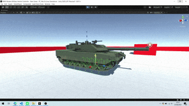

Create your own MBT Vehicle
============================================

Before creating your own vehicle, take a look at what comes with the project, 
change some settings so that you understand a little of what each option does, 
but anyway we are trying to make it as simple as possible to configure, alias, 
if by If you find something that doesn't make sense or is difficult to configure 
or understand, please send your feedback to help us make MMV better every day.

.. _Simple vehicle tutorial:

Importing vehicle model
~~~~~~~~~~~~~~~~~~~~~~~~

.. figure:: img/3d_view_blender_model.png

.. warning::

    Before importing a 3d model, make it follow the defaults of the example vehicle model:

Hierarchy
---------

To create a complete vehicle, you need 8 components, but only 3 are required:
    * Body
    * Turret
    * Cannon
    * Left wheels (all separate)
    * Right wheels (all separate)
    * Armature
    * Left Track (riged)
    * Right Track (riged)

You can follow this example hierarchy to organize your models:

.. figure:: img/mbt_model_hierarchy.png

| **Blue - Empties**
| **Pink - Meshs**
| **Green - Armature**

Orientation
-----------

In order for the MMV to work correctly, make sure your model has **all the 
objects** with the **identity transformation** and must also be pointed with 
the **Z Axis to forward** and and **scale = 1**.

.. warning::
    
    If this is not done, many orientation problems will happen and can 
    generate very annoying bugs, so don't use your model **.Blend file** if you 
    use Blender (or any poorly configured model) as the axes may be in the 
    wrong directions.

.. figure:: img/mbt_orientation_incorretly.jpg

.. figure:: img/mbt_orientation_corretly.jpg

Exporting complex models with armor from Blender to Unity with identity 
transformations is a bit complicated, luckily there is a `plugin for Blender 
<https://github.com/EdyJ/blender-to-unity-fbx-exporter>`__ that can do the 
export in a simple way, I recommend you use it to not have so many problems.

.. note::

    If you use other 3D modeling software and also have export issues,  please 
    open a `new Issue <https://github.com/RuanLucasGD/MMV-Docs/issues>`__ so 
    we can work on it.

After installing the plugin, you will have this option along with the other 
export options.

.. figure:: img/export_to_unity_plugin_demonstration.jpg

Tracks
------

.. figure:: img/mbt_tracks_demonstration.png

For treadmill vehicles, there must be 2 models, left treadmill and right 
treadmill that need to be attached to a skeleton. The skeleton must have 
bones that run through the entire mat, one bone per wheel.

.. figure:: img/3d_view_blender_tracks_structure.png

These settings are important because the bones will simulate the movement 
of the conveyor, each bone will follow the position of the wheels (via 
script, no configuration is needed for this in the model), and with this 
the conveyor will follow the position of the wheels .

Track movement depends on how your UV has been set up. UV influences speed, 
direction and how the belt is drawn on the model.

.. figure:: img/mbt_track_uv.jpg

Simple Vehicle
~~~~~~~~~~~~~~~

For starters, it's important that you have a test scene to be able to simulate 
physics, let's use this simple scene for the tutorial.

.. figure:: img/sample_environment.jpg

Now drag your vehicle model to the scene for us to configure. This is the default 
template that comes in the example assets.

.. figure:: img/mbt_example_model.jpg

Vehicle Hierarchy
-----------------

Before adding the control and physics scripts we need to configure the wheels, the 
wheel hierarchy is similar to any standard Unity vehicle, you need to have empty 
gameObjects for physics and another gameObject like meshRenderer for the wheel model.

.. figure:: img/mbt_wheels_hierarchy.jpg

The first and last wheel on each side don't need to go with the others as they don't 
have physics, of course it depends on your vehicle, but let's focus on this one. These 
wheels only need to keep up with the rotation of the others and that's why they have a 
different configuration and we don't need to modify anything here.

.. figure:: img/mbt_wheels_example_hierarchy_2.jpg

Minimum functional
------------------

Make sure the model has some collider for your body.

.. figure:: img/sample_vehicle_collisor.jpg

For your MBT to have physics add the ``MMV_MBT_Vehicle`` component to your **GameObject 
root of the vehicle**

.. figure:: img/sample_vehicle_add_component.jpg

When the component is added, many settings will already be adjusted to make your life 
easier, including a **RigidBody** component will be added and its mass will be set to 1000, 
the default setting.

.. figure:: img/sample_mmv_mbt_component.jpg

To see it work we must add the wheels to our wheel manager. Let's select the empty gameObjects 
that represent the wheel colliders.

.. figure:: img/mbt_wheel_colliders.jpg

You can add your wheels here, be careful to separate the sides correctly (right and left).

.. figure:: img/mbt_vehicle_component_wheels.jpg

Once you have added the objects for the wheel colliders, it will look something like this. 
We'll leave the other spaces empty, we don't need them now.

.. figure:: img/mbt_vehicle_component_wheels_added.jpg

That's enough for our vehicle to have physics. If your **Gizmos** are active and the vehicle is 
selected you will be able to see the representation of the wheels.

.. figure:: img/mbt_physics_representation.jpg

Adding a Simple Controller
--------------------------

To be able to control your vehicle, add this component, it already gives you all the necessary 
inputs to control your vehicle using keyboard, mouse and gamepad.

.. figure:: img/adding_controll_component.jpg

Add the Axis of your project inputs to make your vehicle move. Also add some key or button on 
the gamepad for the brake. You don't need to have both inputs configured, you can control the 
vehicle with just one input type.

.. figure:: img/controll_vehicle_component.jpg

Once configured we can see the controls working.

Advanced Vehicle Configuration
~~~~~~~~~~~~~~~~~~~~~~~~~~~~~~

To proceed, make sure you have seen the previous chapter of this `Simple vehicle tutorial`_ as 
it explained important things on how to create a vehicle. Here is a continuity showing details 
of configurations and how to improve our vehicle, let's go module by vehicle module, talk about 
control and camera, have fun.

Engine
------

An important module for making wheel acceleration and brake calculations.

Acceleration
............

Configure to make the vehicle more agile, control the maximum speed, acceleration speed, brake 
force and maximum rotation speed.

.. figure:: img/mbt_engine_module_2.jpg

Acceleration

    * **velocity:** the speed at which the vehicle accelerates, change so that the engine can reach full throttle faster or slower. Speed also influences the speed the vehicle takes to change direction (turn).
    * **max:** the maximum engine throttle, the greater the power, the better for riding on broken terrain and the rotation speed improves and increases.
    * **slowdown:** The force to decelerate when the controller does not provide any accelerating force.

velocity

    * **forward:** maximum speed the vehicle can move forward.
    * **backward:** maximum speed the vehicle can move backward.

Sterring

    * **max rotation speed:** limits the rotation speed (change of vehicle direction) when the acceleration force of the engine is too high.

Brake
.....

Configure the vehicle brake.

.. figure:: img/mbt_engine_module_3.jpg

Brake

    * **brake force:** brake force.

Gear System
...........

Configure so that the engine has different acceleration phases (transmission system), 
the gear change is done by automatic. The higher the current gear, the higher the speed 
and the lower the acceleration force, making it harder to climb hills. The gear shift 
also influences the engine sound.

.. figure:: img/mbt_engine_module_4.jpg

Gear Settings
    
    * **loss of strength:** How much power the vehicle loses per gear, influences acceleration at high speeds and steep hills or any complicated place.

Forward Gears

    * **gears amount:** the amount of gears to accelerate forward.
    * **gears:** set the values for gear changes at the correct speed.

    **Example**

    .. figure:: img/gear_bar.png

Backward Gears

    * **gears amount:** the amount of gears to accelerate backward.
    * **gears:** set the values for gear changes at the correct speed.

Engine Sound
............

Simulate engine sound with gearshift effects

.. figure:: img/mbt_engine_module_5.jpg

* **audio source:** audio player responsible for reproducing the engine sound.
* **audio clip:** engine sound audio clip.
* **min pitch:** minimum pitch simulates the engine without acceleration.
* **max forward pitch:** the higher the pitch the easier it is to notice the full throttle of the engine moving forward.
* **max backward pitch:** the higher the pitch the easier it is to notice the full throttle of the engine moving backward.