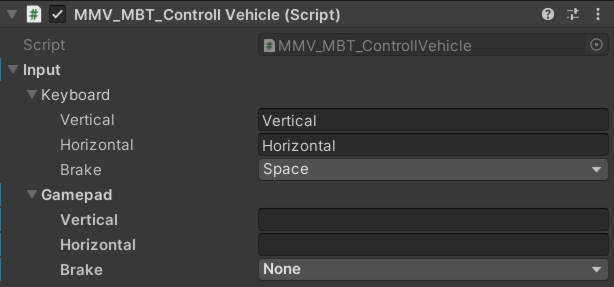
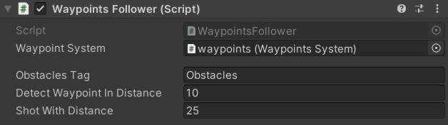
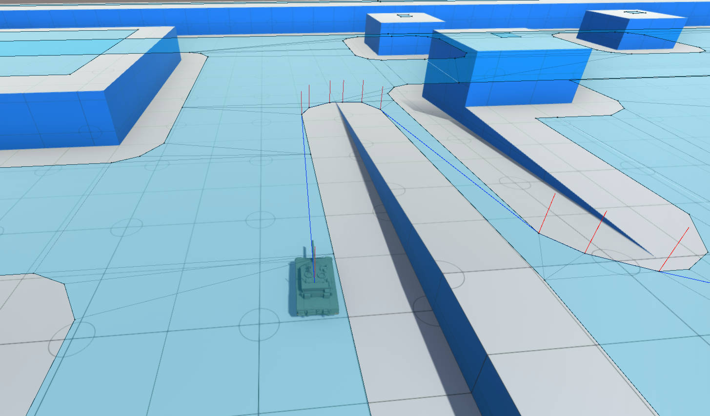
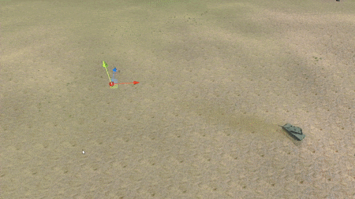
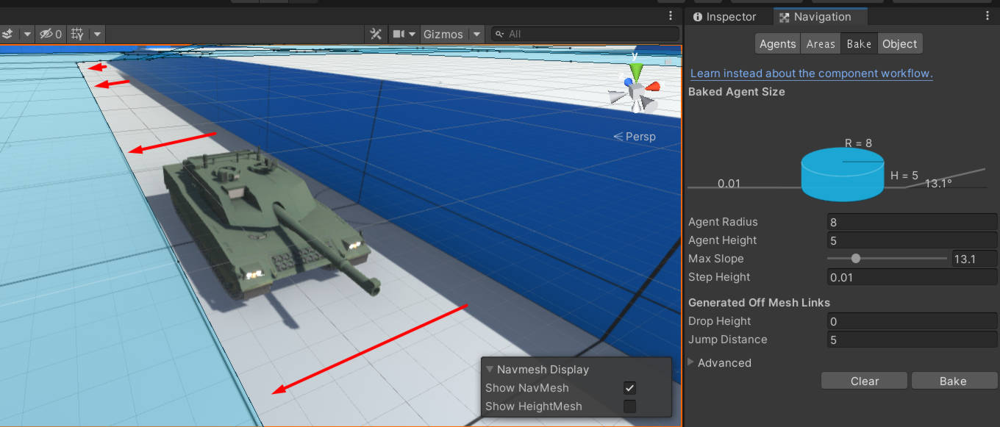
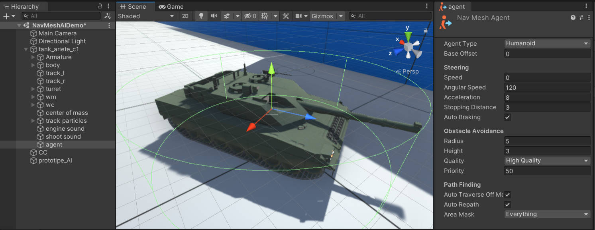
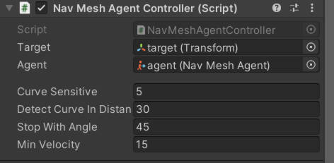

==================
Custom Controllers
==================

The controllers will bring your vehicles to life, the MMV gives you 
several functions so you can create custom controllers so you can fit 
vehicles into games with different mechanics in a simple way. At the 
moment the only official controller is the player's controller, but 
that doesn't mean you shouldn't use the ones that come in the asset's 
examples, you can simply auteralos if you want, but we recommend creating 
your own so that you understand how it works (don't worry, see q creating 
a controller is).

Overview of examples
--------------------

Player Controller
~~~~~~~~~~~~~~~~~

As mentioned above, the only default controller at the moment is the player 
``MMV_MBT_ControllVehicle`` with him you can move around the map using the unity 
`inputs <https://docs.unity3d.com/Manual/class-InputManager.html>`__. The controller is all about going forward, to the side and braking. 
To control the turret the camera script passes the coordinate of the target to 
the vehicle turret, nothing more.

.. figure:: img/custom_controllers/player_controller.jpg

You can configure the controller for keyboard and gamepad.

Waypoint Follower
~~~~~~~~~~~~~~~~~

The ``WaypointsFollower`` controller follows an already configured path of points passing the 
position of the target to the vehicle.

.. figure:: img/custom_controllers/waypoints_follower.jpg

WaypointsFollower Controller:

* **WaypointSystem:** The object that contains the waypoints (only used to give waypoints to this controller).
* **ObstaclesTag:** The tag of all objects that are used as a target for the turret, when there is an object in front with this tag the cannon will fire.
* **DetectWaypointsInDistance:** When you get close (within that distance) to the waypoint, switch to the next.
* **ShotWithDistance:** When an object is detected at this distance, the cannon must fire.

Nav Mesh Agent 
~~~~~~~~~~~~~~~

This example ``NavMeshAI`` controller generates random positions within the map and uses Unity's own `NavMesh <https://docs.unity3d.com/Manual/nav-BuildingNavMesh.html>`__ 
and `NavMeshAgent <https://docs.unity3d.com/Manual/nav-CreateNavMeshAgent.html>`__ system to find its way to its target.

Add a `NavMeshAgent <https://docs.unity3d.com/Manual/nav-CreateNavMeshAgent.html>`__ as a child of the vehicle to do the AI calculations and add your agent to your controller and see the 
vehicle moving around the scene independently avoiding obstacles.

.. figure:: img/custom_controllers/navmesh_agent_controller.jpg
    :scale: 70%

NavMeshAI Controller:

* **StopWithAngle:** When the vehicle is out of the direction it is supposed to go, it must stop, turn until it is in line with the direction it is supposed to go, and then start walking again. This angle is the tolerance that the vehicle may be misaligned with the direction it should go, it is recommended to leave 20 to 45 degrees.
* **Curve Sensitive:** the greater the greater the force of the brake on the.
* **DetectCurveInDistance:** The distance that the controller detects a turn and starts to brake.

Creating a Custom Controller
----------------------------

In order for a vehicle to move, you need to pass the player's inputs (vertical, 
horizontal and say when it should brake), in the case of an AI you can simply pass 
the direction it should come or pass a NavMeshAgent to it so that he can move 
within a scene without major problems. In the case of the tower, just pass a 
position in the world.

.. note::

    Before proceeding, have a vehicle already configured without a control script. If you don't 
    have any vehicle, you can use the same one that comes with the asset (disable its control) or read :doc:`creating_vehicle`

Player Controller
~~~~~~~~~~~~~~~~~

Use it to pass user controls to the vehicle. Add this component to your vehicle 
and it will be working, just pay attention to the position of your camera so that the sight works well.

.. code-block:: csharp

    using MMV;
    using UnityEngine;

    public class SimplePlayerController : MonoBehaviour
    {
        private MMV_MBT_Vehicle vehicle;

        void Start()
        {
            vehicle = GetComponent<MMV_MBT_Vehicle>();
        }

        void Update()
        {
            Transform camera = Camera.main.gameObject.transform;

            // inputs of player
            float horizontal = Input.GetAxis("Horizontal");
            float vertical = Input.GetAxis("Vertical");
            bool isBraking = Input.GetKey(KeyCode.Space);

            // get turret target position
            Vector3 turretTarget = camera.position + (camera.forward * 100);

            if (Physics.Raycast(camera.position, camera.forward, out RaycastHit hit, 100))
            {
                turretTarget = hit.point;
            }

            // controlling the vehicle
            vehicle.PlayerInputs(vertical, horizontal, isBraking);
        }
    }

This code is already a big part of the control. We can drive the vehicle across the map, 
brake and still control the turret. The position of the target of the tower is in front 
of the camera, we put a raycast in case you have an obstacle in front.

Moving to position
~~~~~~~~~~~~~~~~~~

You can also create a controller to move the vehicle to the desired position just passing 
its coordinate in the world and the limit angle to make turns.

.. code-block:: csharp

    using MMV;
    using UnityEngine;

    public class MoveTo : MonoBehaviour
    {
        public Transform target;
        private MMV_MBT_Vehicle vehicle;

        void Start()
        {
            vehicle = GetComponent<MMV_MBT_Vehicle>();
        }

        void Update()
        {
            vehicle.MoveTo(target.position, 45);            // move to target position
            vehicle.TurretTargetPosition = target.position; // look to target 
        }
    }

Using Nav Mesh Agent
~~~~~~~~~~~~~~~~~~~~

A type a little more complicated than the others as it depends on external factors 
to make it a good AI. To use NavMeshAgent you obviously need to have a map with 
your `NavMesh <https://docs.unity3d.com/Manual/nav-BuildingNavMesh.html>`__ already generated.

We can use this map as an example, have environments with a lot of space, vehicles are big 
and need space to be able to turn.

.. figure:: img/custom_controllers/nav_mesh_map_example.jpg

Leaves plenty of space from the navmesh to the sides so you don't have problems when the 
vehicle needs to turn at these extremes.

add a **child object** with the `NavMeshAgent <https://docs.unity3d.com/Manual/nav-CreateNavMeshAgent.html>`__ component and configure it the way you want, 
pay more attention to the **radius** and **height**, **speed** makes no difference as the vehicle 
will not use the agent's movement, speed will be 0 instantly whenever the vehicle is 
going to use the agent.

This script is responsible for controlling the vehicle, it uses its agent to generate 
the path, and uses the path and follows it, a big difference from this method to ``MoveTo``, 
showing previously, is that this mode can do the acceleration calculation on curves, 
reducing the risk of missing the path when at high speed.

.. code-block:: csharp

    using MMV;
    using UnityEngine;
    using UnityEngine.AI;

    public class NavMeshAgentController : MonoBehaviour
    {
        public Transform target;
        public NavMeshAgent agent;

        [Space(10)]

        public float curveSensitive;
        public float detectCurveInDistance;
        public float stopWithAngle;
        public float minVelocity;

        private MMV_MBT_Vehicle vehicle;

        void Start()
        {
            vehicle = GetComponent<MMV_MBT_Vehicle>();
        }

        void Update()
        {
            vehicle.MoveTo(agent, target.position, curveSensitive, detectCurveInDistance, stopWithAngle, minVelocity);
            vehicle.TurretTargetPosition = target.position;
        }
    }

the script will generate a component with these properties:

* **Curve Sensitive:** the greater the greater the force of the brake on the.
* **DetectCurveInDistance:** The distance that the controller detects a turn and starts to brake.
* **StopWithAngle:** When the vehicle is out of the direction it is supposed to go, it must stop, turn until it is in line with the direction it is supposed to go, and then start walking again. This angle is the tolerance that the vehicle may be misaligned with the direction it should go, it is recommended to leave 20 to 45 degrees.
* **MinVelocity:** minimum vehicle speed, used in curves.

Fire Controller
~~~~~~~~~~~~~~~

The fire control works in a similar way as a vehicle controller, access the fire component and 
execute the fire, just like that. If you haven't seen about shooting control, read MMV_Shooter.

.. code-block:: csharp

    using MMV;
    using UnityEngine;

    public class Shot : MonoBehaviour
    {
        private MMV_Shooter shooter;

        void Start()
        {
            shooter = GetComponent<MMV_Shooter>();
        }

        void Update()
        {
            if (Input.GetKeyDown(KeyCode.Mouse0))
            {
                shooter.Shoot();
            }
        }
    }
