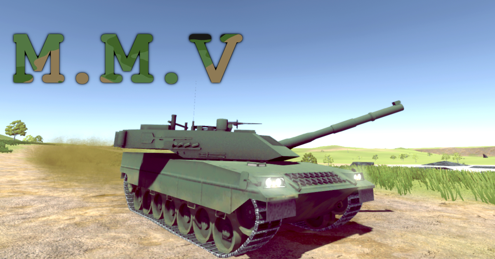

Welcome!
========

Welcome to the **MMV (Modern Military Vehicle System**) documentation. 
Here you will have all the information you need to create your own 
vehicles based on the system, if you find any writing errors or even 
system inconsistency please report the problem to us via github. 
Implementation and correction requests are also welcome!

To get started, you can download the system through the `store <https://assetstore.unity.com/packages/tools/physics/mmv-modern-military-vehicle-system-197871>`__.

Video tutorials are also available on Youtube

Below you will see all the **MMV** documentation separated by themes, enjoy:

.. toctree::
    :maxdepth: 2

    introduction
    overview
    tracked_vehicles
    wheeled_vehicles
    configuration_files
    another_systems
    custom_controllers