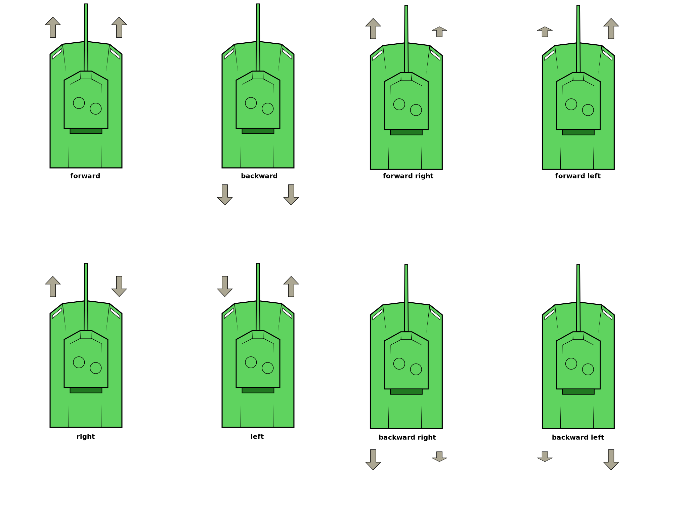
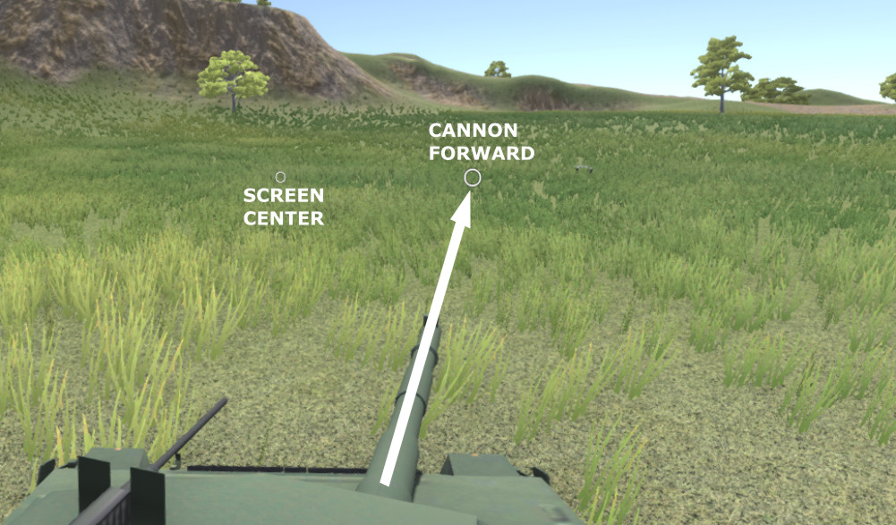

Overview
========

Modules
-------------------

An **MMV_vehicle** is composed of modules, each module is responsible for controlling some component. An example 
would be an MBT (Main Battle tank) vehicle that contains the modules **MMV_MBT_Engine**, **MMV_MBT_WheelManager**, 
**MMV_TurretController**. The component **MMV_MBT_Vehicle**, the vehicle's main physics script, contains all these 
modules that work together, the data delivered by a given module are used by other modules making them 
interconnected.

Below is a diagram that demonstrates how these modules are wired. The engine must deliver the left and right throttle 
and brake force to the wheel manager. The manager must apply the suspension force and use the acceleration and brake 
forces on the wheels.

.. figure:: /img/overview/mbt_overview_diagram.jpg

There are specific forces for each side, as each track has its own acceleration and brake, increasing the force on 
one side and decreasing it on the other can cause the vehicle to rotate, thus being a form of steering. How the move 
works will be explained below.

Behaviour
---------

Acceleration
~~~~~~~~~~~~

The engine delivers different forces to each side of the wheels, left and right, acceleration left, right, left and 
right brakes using inputs given by some controller, this controller tells the vehicle whether to go forward or 
backward or to turn right and left.

.. note::

    Example code

.. code-block:: 

    vehicle.Acceleration = 1;   // forward
    vehicle.Acceleration = -1;  // backward
    
    vehicle.Sterring = 1;       // left
    vehicle.Sterring = -1;      // right

The movement consists of the more you accelerate, the less you should brake (or the more you brake, the less you should 
accelerate). By changing the acceleration weights on each side we can change the direction in which the vehicle moves 
or turns it.

When configuring your vehicle, remember that the amount of front and side friction, amount of acceleration, acceleration 
speed and brake force influence the rotation speed of the vehicle

.. figure:: img/overview/mbt_movement_demo.gif

motion representation

Aim Control
~~~~~~~~~~~

Most of the hard work of the fire controller has already been done, just create a custom controller (or use one that comes 
with the system) to tell you where the target is, a global space position ``Vector3`` and that's enough to the turret and 
the cannon aim at the target

The aim is very precise and can hit targets even if the vehicle is at difficult angles and the rotation speed is always 
constant.

.. figure:: img/overview/vehicle_angle_gun_demo.svg

The tower has no rotation limit, 360° angle

Camera Control
~~~~~~~~~~~~~~

The default camera controller already tells the turret where it should aim, and also shows in its UI a vector marker of the 
front of the cannon to know where it's aiming at the moment, it works the same way we see in games like world of tanks or war 
thunder.

To make this marker work it was necessary to do a little more than take the cannon's front position using raycasts and convert 
it to screen space, that's because Unity can't return the exact position when the forward distance is too far, the values come 
out completely different from what they were supposed to be.
To get around this, a raycast was done from the camera to the position of the front of the cannon (with raycast) and a 
``Quaternion.LookAt`` to that position. The forward vector of this ``(lookAt * Vector3.forward) + cameraPos`` converted to screen 
space was the form used to get the position of the cannon's crosshair marker.

.. figure:: /img/overview/cannon_ui_marker.svg
