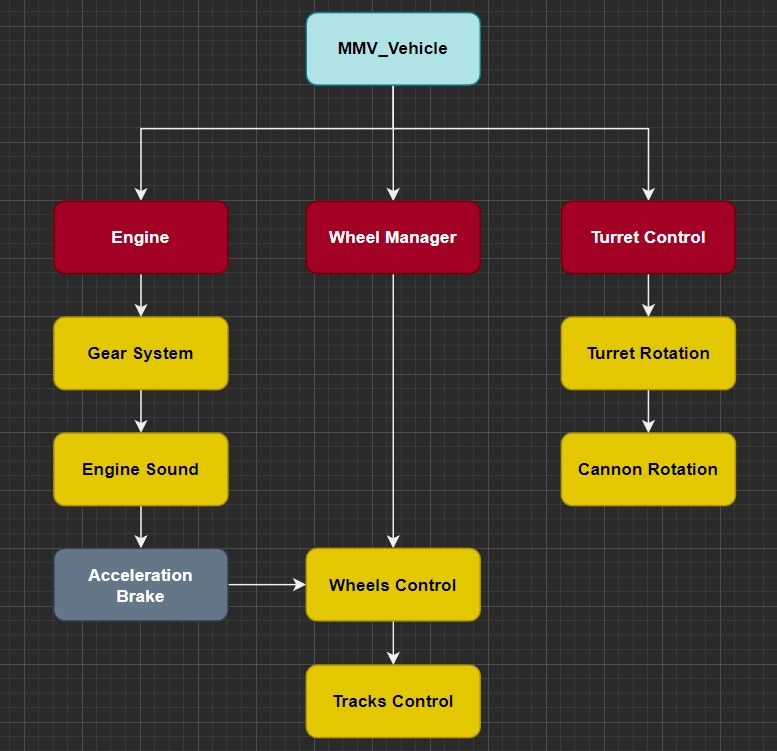
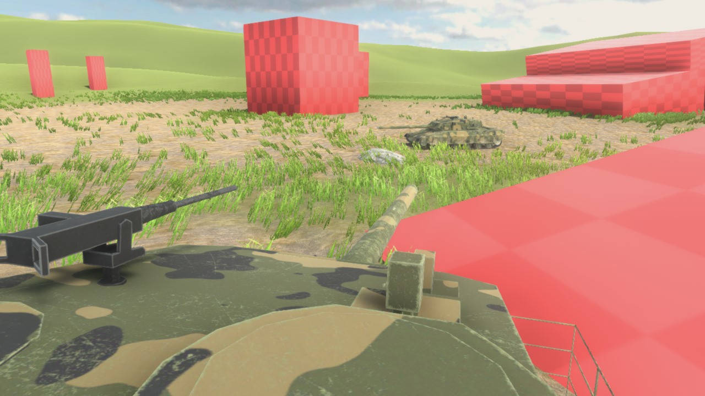

Overview
========

Here's a summary of how the **MMV** architecture works and what you can do.

The Main System
~~~~~~~~~~~~~~~

The main system consists of vehicle physics and the entire control system, such 
as acceleration, steering, braking and gun turret movement. All other systems are just 
**add-ons** to this main system and are **not mandatory**, allowing them to be replaced 
by one customized to the developer's taste. Here's a summary of how the **MMV** 
architecture works and what you can do.

The vehicle system is made up of **modules** that communicate, each module is responsible 
for an essential part of the vehicle. You can access some vehicle API functions and 
give commands, for example, tell the vehicle where to go or tell the gun turret module 
where to aim, (this will be explained in the next modules of this documentation).

How the vehicle behaves
~~~~~~~~~~~~~~~~~~~~~~~~

The **MMV** has a custom wheel physics system, we managed to make the wheel configuration 
very simple and it is still very stable for the purpose of Asset. The vehicle's system 
will already do most of the hard work for you and so you just need to take care of passing 
the control commands.

Movimentation
-------------

In the case of an **MBT** (Main Battle Tank) vehicle, all your vehicle movement control is 
based on the acceleration of the wheels, whether they are going backwards or forwards 
and the speed at which they are moving. An MBT vehicle from the **MMV** is no different, we 
use this same principle, to better understand, below is an example of how the acceleration 
influences the vehicle's direction.

How do Tracks Work
------------------

The tracks use fake simulation to look like they actually move. The treadmill model is
linked to a bone armature, one bone per wheel and via script this bone will follow the wheel's 
position generating the effect that movement.

.. figure:: images/overview/suspension_demo.gif
    :alt: 0%
    :scale: 155%

This solves the suspension problem, but there is another point that needs attention, which 
is the issue of vehicle acceleration, the treadmill needs to respond to the speed at which 
the vehicle moves and for that there is an integrated system in the wheel control script of 
the MBT vehicle that changes the texture offset of the mat material giving the feeling of 
movement.

.. figure:: images/overview/mbt_movement_demo.gif
    :alt: 0%
    :scale: 140%

Weapon System
-------------

Only the turret system is integrated into the vehicle, fire control is done separately by other 
scripts. The main job of the turret is just aiming at some position in the world respecting the 
vehicle's angle limits.

