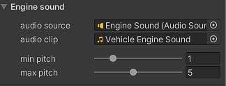
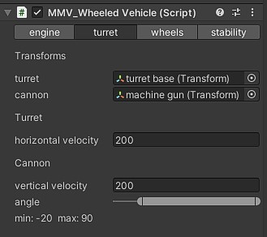
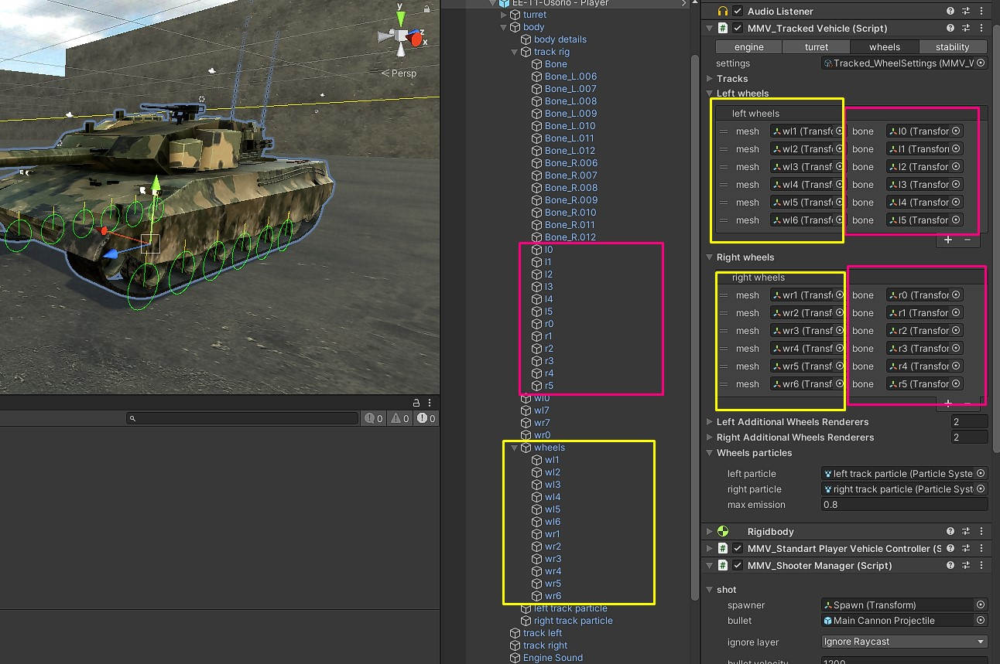
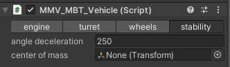

.. _wheeled-vehicles:

Tracked vehicle Component Configuration
=======================================

Responsible for simulating the entire system of a vehicle with tracks.

Vehicle Component
~~~~~~~~~~~~~~~~~

A vehicle component is composed of some modules, each module controls a specific part as you can 
see in the image.

Let's explain the vehicle component separated by modules.

Engine
------

Module responsible for all parts of the vehicle's power, movement, engine sound and braking system.

**Engine Settings:** :ref:`configuration file <engine settings>` containing all engine parameters

Engine Sound
............

Control the sound of the vehicle's engine.

**audio source:** Any audio source that is in the vehicle that can be used to 
reproduce the sound of the engine.

**audio clip:** Your engine's audio clip.

**min pitch:** The lowest pitch that the engine sound can reach if it's not accelerating.

**max pitch:** The maximum pitch that the engine sound can reach when accelerating.

Turret
------

This module is responsible for controlling the turret and aiming the vehicle.

Transforms
..........

**turret:** Vehicle weapon system turret.

**cannon:** Cannon that is connected to the vehicle's turret.

**horizontal velocity:** The speed at which the turret flips horizontally towards the target.
**vertical velocity:** The speed at which the cannon turns vertically towards the target.

Wheels
------

The wheel module manages all of the vehicle's wheels, applies suspension physics and tells them 
when to accelerate or brake. It makes the vehicle turn and even the tracks move.

**settings:** :ref:`Configuration file <wheel settings>` that contains all the parameters for suspension and behavior of the vehicle's wheels

Tracks
------

Add here the meshes of your vehicle's tracks, so that they follow the movement of the wheels.

**multiply rotation velocity:** If your belt is not moving at the correct speed, change this value 
to correct the speed.

Left/Right Wheels
.................

Add your vehicle's wheels here.

**Mesh:** Object that will be used to apply wheel physics on the vehicle.

**Bone:** A track bone, which is next to the wheel.

Left/Right Additional Wheels Renderers
......................................

Add here the wheel meshes that don't apply physics but must rotate along with the others like the front 
and back wheels of the tank.

Wheels Particles
................

It is possible to add particles to the wheels so that when the vehicle moves, they are installed, such as dust.

**left/right particle:** The particle on either side of the vehicle.

**max emission:** The particle on either side of the vehicle.

Stability
---------

Control vehicle stability.

**Angle deceleration:** how much gravity influences the vehicle when going uphill or steep places.

**center of mass:** The vehicle's center of mass, recommended to leave in the center, the higher on the Y axis, 
the easier it will be for the vehicle to tip over in curves.

