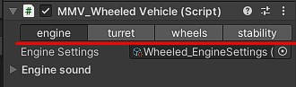
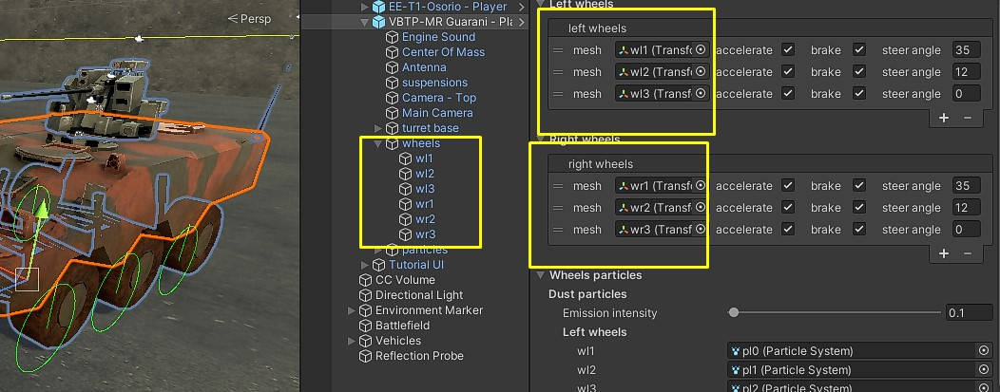

Wheeled Vehicle
===============

Responsible for simulating all types of vehicle that uses wheels.

Vehicle Component
~~~~~~~~~~~~~~~~~

A vehicle component is composed of some modules, each module controls a specific part as you can 
see in the image.

Let's explain the vehicle component separated by modules.

Engine
------

Module responsible for all parts of the vehicle's power, movement, engine sound and braking system.

**Engine Settings:** :ref:`configuration file <engine settings>` containing all engine parameters

Engine Sound
............

.. figure:: images/tracked_vehicle/engine_sound.jpg

Control the sound of the vehicle's engine.

**audio source:** Any audio source that is in the vehicle that can be used to 
reproduce the sound of the engine.

**audio clip:** Your engine's audio clip.

**min pitch:** The lowest pitch that the engine sound can reach if it's not accelerating.

**max pitch:** The maximum pitch that the engine sound can reach when accelerating.

Turret
------

.. figure:: images/advanced_configurations/vehicle/vehicle_turret.jpg

This module is responsible for controlling the turret and aiming the vehicle.

Transforms
..........

**turret:** Vehicle weapon system turret.

**cannon:** Cannon that is connected to the vehicle's turret.

**horizontal velocity:** The speed at which the turret flips horizontally towards the target.
**vertical velocity:** The speed at which the cannon turns vertically towards the target.

Wheels
------

.. figure:: images/wheeled_vehicle/wheels.jpg

The wheel module manages all of the vehicle's wheels, applies suspension physics and tells them 
when to accelerate, brake and steer.

**settings:** :ref:`Configuration file <wheel settings>` that contains all the parameters for suspension and behavior of the vehicle's wheels

Left/Right Wheels
.................

Add your vehicle's wheels here.

**Mesh:** Object that will be used to apply wheel physics on the vehicle

**Accelerate:** If the wheel is able to use the acceleration force

**Brake:** If the wheel is able to brake

**Steer Angle:** How far can this wheel turn

Wheels Particles
................

Add a particle to each of your wheels so that when the vehicle is driven, dust can come out of the wheels.

**Emission intensity:** The intensity of particles that will be instantiated at vehicle speed

**Left/Right wheels:** particle from each of your wheels

Stability
---------

Control vehicle stability.

.. figure:: images/advanced_configurations/vehicle/vehicle_stability.jpg

**Angle deceleration:** how much gravity influences the vehicle when going uphill or steep places.

**center of mass:** The vehicle's center of mass, recommended to leave in the center, the higher on the Y axis, 
the easier it will be for the vehicle to tip over in curves.